# Avaliação de Segurança da Aplicação CineViewExperience

Cesar School  
Ciência da Computação  
Segurança Cibernética  

Professor: Henrique Arcoverde  
Aluno: Pedro Coelho  

Recife – PE  
19 de abril de 2025

## Resumo

**Objetivo**  
Avaliar a segurança da aplicação CineViewExperience, com foco na identificação de vulnerabilidades práticas que possam ser exploradas por usuários autenticados e não autenticados.

**Metodologia**  
A análise foi realizada manualmente por meio da exploração direta da aplicação, combinando técnicas de mapeamento de superfície de ataque, manipulação de requisições, análise de fluxos e verificação de comportamentos inesperados em funcionalidades críticas.

**Ferramentas**  
Firefox DevTools, Burp Suite Community, scripts Python, VS Code e ambiente Kali Linux.

**Escopo**  
A avaliação foi conduzida em ambiente local com base nas instruções do repositório. Foram examinadas páginas públicas, fluxos de login e recuperação de conta, gerenciamento de pedidos e funcionalidades administrativas.

**Período da Avaliação**  
- Início: 16/04/2025  
- Término: 19/04/2025  

**Vulnerabilidades Identificadas**  
Foram identificadas 10 vulnerabilidades de segurança, classificadas conforme o OWASP Top 10:2021 e suas respectivas CWE. As falhas abrangem desde exposição indevida de diretórios até falhas graves de autenticação e controle de acesso.

**Principais Impactos**  
- Comprometimento de contas privilegiadas e sequestro de sessões  
- Exposição de lógica da aplicação e estrutura interna do backend  
- Fraudes financeiras via manipulação de valores de pedidos  
- Risco elevado de ataques automatizados e escalonamento de privilégios  

### Tabela Resumo das Vulnerabilidades

| #  | Título                                                       | Endpoint(s)                                           | Parâmetro(s)                | Componente Afetado                              | Abrangência                   | OWASP         | CWE                                |
|----|--------------------------------------------------------------|-------------------------------------------------------|-----------------------------|--------------------------------------------------|-------------------------------|----------------|-------------------------------------|
| 1  | Exposição de diretórios sensíveis (Directory Listing)        | /js/, /assets/, /css/, /?debug=devtools               | –                           | servidor web (arquivos estáticos)              | aplicação client-side         | A05:2021       | CWE-548                            |
| 2  | Enumeração de usuários na recuperação de senha               | /recover/verify                                       | username                    | backend (verificação de identidade)            | usuários não autenticados     | A07:2021       | CWE-204                            |
| 3  | Reset de senha sem validação de identidade                   | /recover/reset                                        | username, password          | backend (fluxo de recuperação)                 | usuários não autenticados     | A07:2021       | CWE-640                            |
| 4  | Tokens de sessão previsíveis (Time-based)                    | /login                                                | token (cookie)              | backend (geração de sessão)                    | todos os usuários             | A02:2021       | CWE-341                            |
| 5  | Session fixation                                             | todas as rotas autenticadas                           | token (cookie)              | backend (controle de sessão)                   | usuários não autenticados     | A01:2021       | CWE-384                            |
| 6  | Session hijacking                                            | todas as rotas autenticadas                           | token (cookie)              | backend (validação de sessão)                  | usuários autenticados         | A01:2021       | CWE-613                            |
| 7  | Enumeração de privilégios por endpoint exposto               | /isAdmin                                              | token (cookie)              | backend (verificação de privilégios)           | usuários autenticados         | A01:2021       | CWE-203                            |
| 8  | IDOR – Modificação e exclusão de dados de terceiros          | /edit-username, /edit-email, /edit-phone, /delete_user | id                         | backend (controle de recursos)                 | usuários autenticados         | A01:2021       | CWE-639                            |
| 9  | Manipulação de preço via parâmetro client-side               | /order                                                | total_price                 | backend (processamento de pedidos)             | usuários autenticados         | A04:2021       | CWE-302                            |
| 10 | Ausência de controles críticos de autenticação e recuperação de conta          | /login, /recover/reset, /edit-*                       | –                           | backend (autenticação e gestão de contas)      | todos os usuários             | A07:2021       | CWE-306, 307, 521, 640             |

### Distribuições Visuais

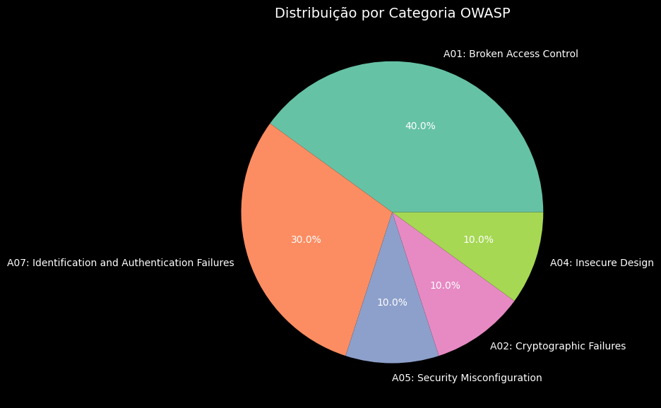

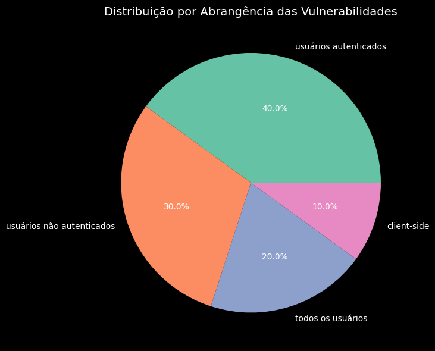

## Vulnerabilidades

1. [Exposição de diretórios sensíveis (Directory Listing)](#1-exposição-de-diretórios-sensíveis-directory-listing)  
2. [Enumeração de usuários na recuperação de senha](#2-enumeração-de-usuários-na-recuperação-de-senha)  
3. [Reset de senha sem validação de identidade](#3-reset-de-senha-sem-validação-de-identidade)  
4. [Tokens de sessão previsíveis (Time-based)](#4-tokens-de-sessão-previsíveis-time-based)  
5. [Session fixation](#5-session-fixation)  
6. [Session hijacking](#6-session-hijacking)  
7. [Enumeração de privilégios por endpoint exposto](#7-enumeração-de-privilégios-por-endpoint-exposto)  
8. [IDOR – Modificação e exclusão de dados de terceiros](#8-idor--modificação-e-exclusão-de-dados-de-terceiros)  
9. [Manipulação de preço via parâmetro client-side](#9-manipulação-de-preço-via-parâmetro-client-side)  
10. [Ausência de controles críticos de autenticação e recuperação de conta](#10-ausência-de-controles-críticos-de-autenticação-e-recuperação-de-conta)

---

### 1. Exposição de diretórios sensíveis (Directory Listing)

#### Ponto Afetado

- Endpoint(s): `/js/`, `/assets/`, `/css/`, `/?debug=devtools`
- Parâmetro(s): –  
- Componente afetado: servidor web (arquivos estáticos)
- Abrangência: aplicação client-side

#### Descrição

Durante a fase de reconhecimento, foi possível acessar diretamente os diretórios `/js/`, `/assets/` e `/css`, revelando arquivos e subpastas que deveriam estar protegidos. Essa configuração incorreta do servidor permitiu o recurso conhecido como **directory listing**.

Entre os arquivos expostos, estavam diversos scripts JavaScript essenciais (`utils.js`, `dashboard.js`, `adminMovies.js`, `orders.js`) que revelam detalhes importantes da aplicação, como:

- A existência de um painel administrativo (`dashboard.html`);
- O uso do endpoint `/isAdmin` para checar privilégios;
- A presença de um endpoint oculto (`/devtools`) acessível via parâmetro GET;
- A lógica de autenticação baseada exclusivamente no cookie `token`;
- Os formatos dos payloads enviados ao backend por meio de `fetch()`.

O endpoint `/devtools/` revelou a estrutura interna do backend, incluindo nomes de arquivos sensíveis como `server.py`, `routes.py`, `auth.py`. Embora os conteúdos não estejam diretamente acessíveis, o simples mapeamento da estrutura representa uma exposição significativa que pode facilitar ataques posteriores.

#### Classificação

- OWASP Top 10: [A05:2021 – Security Misconfiguration](https://owasp.org/Top10/A05_2021-Security_Misconfiguration/) 
- CWE: [CWE-548 – Information Exposure Through Directory Listing](https://cwe.mitre.org/data/definitions/548.html)

#### Evidências

- Acesso direto ao diretório `/js/`:

  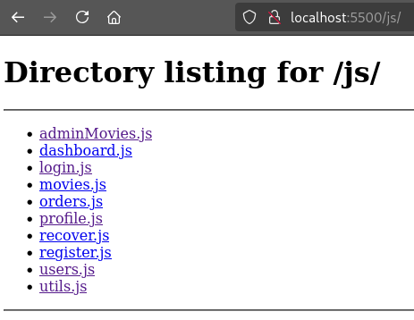

- Listagem da estrutura interna do backend via `?debug=devtools`:

  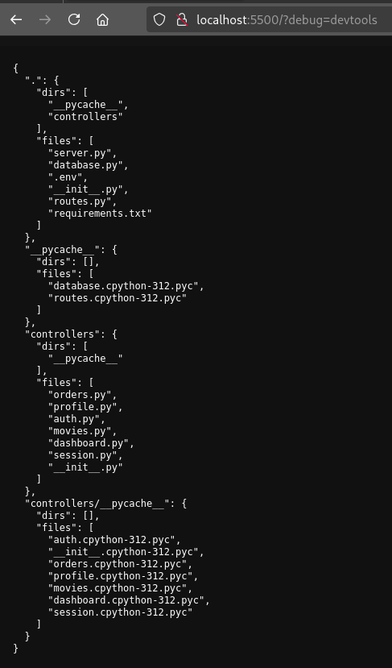

#### Impacto

A exposição de diretórios sensíveis permite que um atacante obtenha informações internas sobre a estrutura da aplicação, scripts utilizados e funcionalidades disponíveis. Isso pode facilitar ataques futuros como escalonamento de privilégios, bypass de autenticação, identificação de endpoints administrativos e exploração de falhas lógicas ou de acesso.

#### Recomendações

- Desabilitar o recurso de listagem de diretórios no servidor web.
- Remover diretórios e arquivos de depuração antes da publicação em ambiente de produção.
- Restringir o acesso a diretórios internos com autenticação ou regras específicas no servidor.
- Utilizar builds minificados e ofuscados para scripts JavaScript em produção.
- Validar acessos e permissões no backend, independentemente de restrições no frontend.

---

### 2. Enumeração de usuários na recuperação de senha

#### Ponto Afetado

- Endpoint(s): `/recover/verify`
- Parâmetro(s): `username`
- Componente afetado: backend (verificação de identidade)
- Abrangência: usuários não autenticados

#### Descrição

O fluxo de recuperação de senha da aplicação apresenta mensagens de erro distintas para cada tipo de falha, o que permite a enumeração de usuários.

Durante os testes, foram observadas duas respostas diferentes ao enviar nomes de usuário no formulário:

- Para um nome inexistente (`carlos`), a resposta foi: "Usuário não encontrado."
- Para um nome existente (`samy`) com dados incorretos, a resposta foi: "Informações incorretas!"

Esse comportamento permite que um atacante utilize o endpoint como um oráculo de verificação, identificando quais nomes de usuário estão cadastrados no sistema, mesmo sem saber outras informações.

#### Classificação

- OWASP Top 10: [A07:2021 – Identification and Authentication Failures](https://owasp.org/Top10/A07_2021-Identification_and_Authentication_Failures/)  
- CWE: [CWE-204 – Observable Response Discrepancy](https://cwe.mitre.org/data/definitions/204.html) 

#### Evidências

- Teste com usuário inexistente `carlos`:

    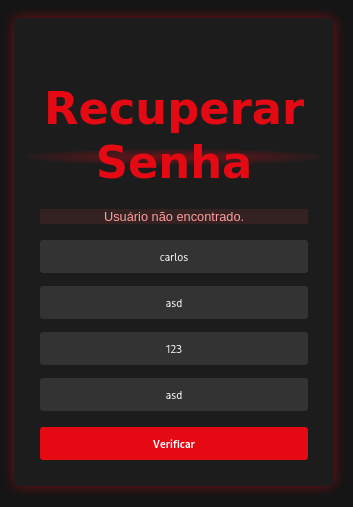

- Teste com usuário existente `samy`, mas dados inválidos:

    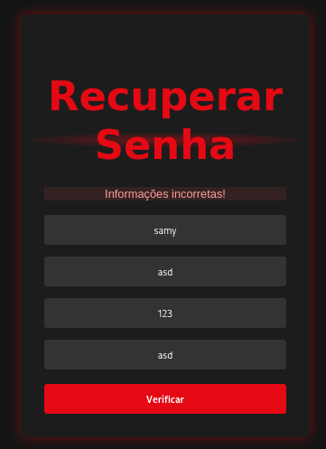

#### Impacto

A possibilidade de distinguir entre usuários válidos e inválidos com base nas mensagens de erro permite que um atacante realize ataques de enumeração. Isso pode levar à obtenção de uma lista de usuários cadastrados na aplicação, facilitando ataques futuros como força bruta, phishing direcionado e exploração de falhas de autenticação.

#### Recomendações

- Padronizar as mensagens de erro para não indicar se o usuário informado é válido ou não.
- Evitar qualquer feedback explícito sobre a existência de contas no sistema.
- Implementar mecanismos de proteção contra automação, como CAPTCHA e rate limiting.
- Monitorar tentativas repetidas de recuperação de senha e gerar alertas em caso de atividade suspeita.

---

### 3. Reset de senha sem validação de identidade

#### Ponto Afetado

- Endpoint(s): `/recover/reset`
- Parâmetro(s): `username`, `password`
- Componente afetado: backend (fluxo de recuperação)
- Abrangência: usuários não autenticados

#### Descrição

A aplicação permite redefinir a senha de qualquer usuário apenas com o envio de um nome de usuário válido, sem exigir autenticação ou qualquer vínculo com uma sessão verificada.

A etapa de redefinição (`/recover/reset`) pode ser acessada diretamente via requisição POST, sem depender do fluxo anterior de verificação (`/recover/verify`). Isso permite que um atacante, conhecendo ou adivinhando o nome de usuário, redefina senhas arbitrariamente — incluindo contas privilegiadas como `admin`.

A ausência de validação entre as etapas do fluxo torna o mecanismo de recuperação vulnerável a ataques de escalonamento de privilégio e controle total de contas.

#### Classificação

- OWASP Top 10: [A07:2021 – Identification and Authentication Failures](https://owasp.org/Top10/A07_2021-Identification_and_Authentication_Failures/)
- CWE: [CWE-640 – Weak Password Recovery Mechanism for Forgotten Password](https://cwe.mitre.org/data/definitions/640.html)

#### Evidências

- Requisição direta ao endpoint de reset usando o nome de usuário `admin`:

  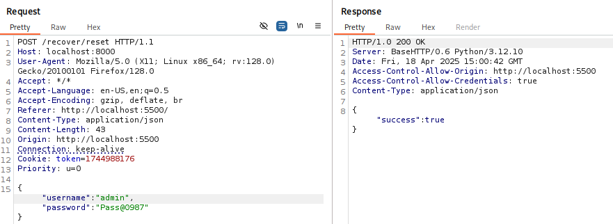

- Acesso confirmado à conta administrativa após alteração da senha:

  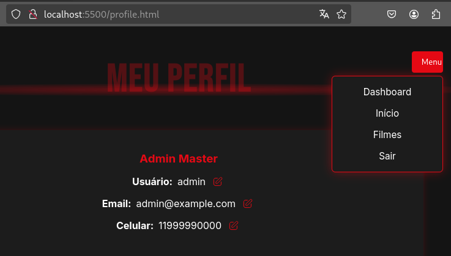

#### Impacto

Permitir a redefinição de senha sem autenticação ou vínculo com uma verificação anterior expõe a aplicação a ataques que resultam na tomada de contas de usuários legítimos. Um atacante pode assumir o controle de contas, inclusive administrativas, comprometendo a confidencialidade, integridade e disponibilidade do sistema.

#### Recomendações

- Exigir uma etapa prévia de verificação de identidade antes de permitir a redefinição de senha.
- Vincular a redefinição a um token temporário e exclusivo enviado por canal seguro.
- Garantir que o endpoint de reset só possa ser acessado após a etapa de verificação.
- Registrar e monitorar todas as ações relacionadas à recuperação de senha.

---

### 4. Tokens de sessão previsíveis (Time-based)

#### Ponto Afetado

- Endpoint(s): `/login`
- Parâmetro(s): `token` (cookie)
- Componente afetado: backend (geração de sessão)
- Abrangência: todos os usuários

#### Descrição

Os tokens de sessão da aplicação são gerados com base em `time.time()`, utilizando o timestamp atual em segundos desde a época UNIX. Essa abordagem torna os tokens altamente previsíveis, permitindo que um atacante estime o momento do login e gere tokens válidos por tentativa.

Durante os testes, um script automatizado foi capaz de identificar múltiplos tokens ativos utilizando essa técnica.

Além disso, foi observado que a aplicação gera um token já no primeiro acesso, antes do login. Esse mesmo token é reaproveitado após a autenticação, sem renovação, o que agrava a previsibilidade e cria um cenário de session fixation.

#### Classificação

- OWASP Top 10: [A02:2021 – Cryptographic Failures](https://owasp.org/Top10/A02_2021-Cryptographic_Failures/)
- CWE: [CWE-341 – Predictable Pseudo-Random Number Generator](https://cwe.mitre.org/data/definitions/341.html)

#### Evidências

- Script em Python para geração de tokens válidos:  
  
    [script.py](script.py)

- Múltiplos tokens válidos identificados com sucesso:

    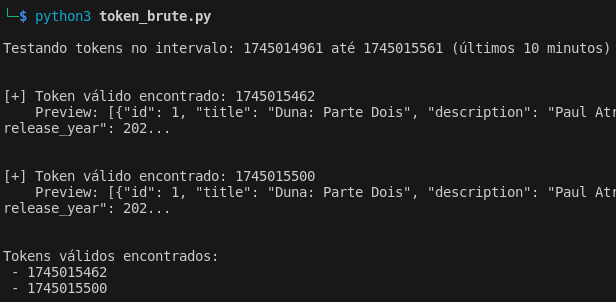

#### Impacto

Tokens de sessão previsíveis podem ser gerados ou adivinhados por atacantes, permitindo o sequestro de sessões de usuários legítimos. Isso compromete a confidencialidade e o controle de acesso, podendo resultar em acessos não autorizados, manipulação de dados e comprometimento de contas privilegiadas.

#### Recomendações

- Utilizar um gerador criptograficamente seguro para tokens de sessão.
- Evitar o uso de dados previsíveis, como timestamps, na composição dos tokens.
- Regenerar o token de sessão após autenticação bem-sucedida.
- Validar e expirar sessões antigas com frequência.

---

### 5. Session fixation

#### Ponto Afetado

- Endpoint(s): todas as rotas autenticadas
- Parâmetro(s): `token` (cookie)
- Componente afetado: backend (controle de sessão)
- Abrangência: usuários não autenticados
  
#### Descrição

A aplicação cria um token de sessão antes da autenticação, o qual permanece ativo mesmo após o login do usuário. Esse comportamento permite que um atacante defina previamente um valor de token conhecido e, ao induzir um usuário a autenticar-se com esse token já setado, tenha controle sobre a sessão resultante.

Esse cenário caracteriza uma session fixation, em que o atacante prepara o ambiente antes da autenticação do alvo.

#### Classificação

- OWASP Top 10: [A01:2021 – Broken Access Control](https://owasp.org/Top10/A01_2021-Broken_Access_Control/)
- CWE: [CWE-384 – Session Fixation](https://cwe.mitre.org/data/definitions/384.html)

#### Evidências

- Cookie de valor fixado (`1`) foi injetado no navegador antes do login:
  
  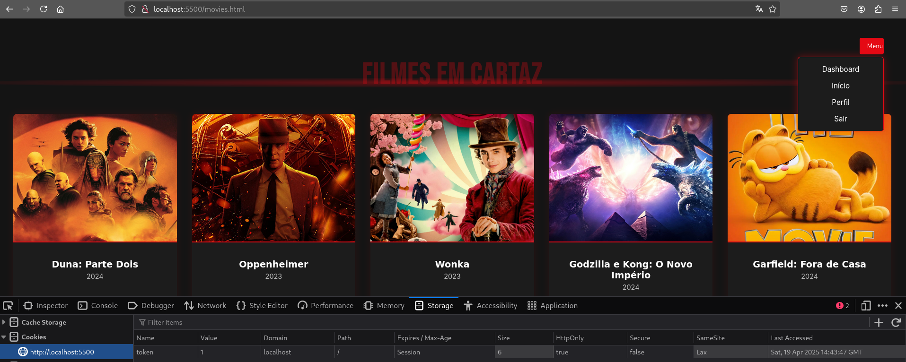

- Após a autenticação, o token permanece válido e garante acesso ao painel administrativo sem rotação ou renovação.

#### Impacto

Ao não renovar o token de sessão após o login, a aplicação permite que um atacante associe um token previamente conhecido a um usuário autenticado. Isso possibilita o controle total da sessão do usuário, comprometendo a confidencialidade e a integridade da conta.

#### Recomendações

- Gerar um novo token de sessão após o login bem-sucedido.
- Invalidar qualquer token anterior à autenticação.
- Impedir que sessões iniciadas antes do login sejam promovidas a sessões autenticadas.
- Adotar tokens com entropia suficiente e protegidos por boas práticas (ex: HttpOnly, Secure).

---
### 6. Session Hijacking

#### Ponto Afetado

- Endpoint(s): todas as rotas autenticadas
- Parâmetro(s): `token` (cookie)
- Componente afetado: backend (validação de sessão)
- Abrangência: usuários autenticados

#### Descrição

Após a autenticação, a aplicação aceita qualquer token válido sem verificação de origem, contexto ou expiração. Durante os testes, foi possível reutilizar tokens autenticados em outras sessões e navegadores, sem qualquer associação com fingerprint de dispositivo, IP ou user-agent.

Esse comportamento representa uma vulnerabilidade de sequestro de sessão, permitindo que um token válido capturado seja reutilizado por um atacante.

#### Classificação

- OWASP Top 10: [A01:2021 – Broken Access Control](https://owasp.org/Top10/A01_2021-Broken_Access_Control/)
- CWE: [CWE-613 – Insufficient Session Expiration](https://cwe.mitre.org/data/definitions/613.html)

#### Evidências

- Token `1745015987` reutilizado com sucesso em nova aba anônima, com acesso direto ao painel administrativo:

  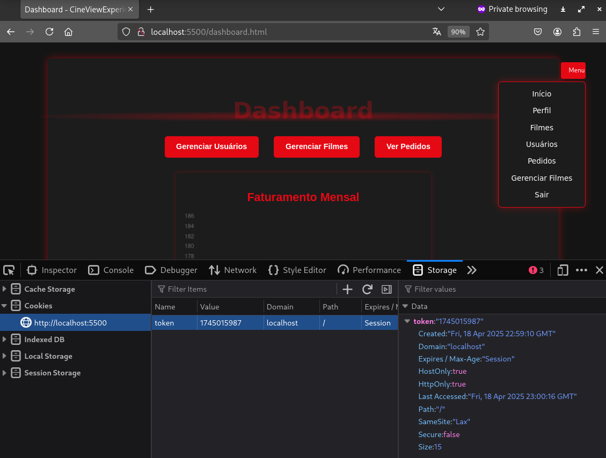

#### Impacto

O uso irrestrito de tokens válidos sem verificação de origem ou expiração permite que atacantes reutilizem sessões legítimas. Isso possibilita acesso não autorizado a contas, manipulação de dados sensíveis, e comprometimento de funcionalidades administrativas ou privadas.

#### Recomendações

- Associar a sessão a informações do cliente, como IP e user-agent.
- Rotacionar tokens de sessão em eventos críticos, como login.
- Expirar tokens automaticamente após período de inatividade.
- Adotar cookies com as flags `Secure`, `HttpOnly` e `SameSite=Strict`.

---
### 7. Enumeração de privilégios por endpoint exposto

#### Ponto Afetado

- Endpoint(s): `/isAdmin`
- Parâmetro(s): `token` (cookie)
- Componente afetado: backend (verificação de privilégios)	
- Abrangência: usuários autenticados

#### Descrição

O endpoint `/isAdmin` retorna `true` ou `false` indicando se o token da sessão atual pertence a um usuário administrador. Essa verificação está acessível a qualquer cliente autenticado, sem restrições adicionais.

Esse comportamento pode ser explorado por um atacante que esteja testando tokens — por exemplo, tokens gerados com base em tempo — para identificar quais pertencem a contas privilegiadas. Com isso, é possível priorizar tokens administrativos em ataques de hijacking.

A exposição dessa informação representa uma forma de disclosure de privilégios e falha de controle de acesso, ao revelar a natureza do usuário sem necessidade real.

#### Classificação

- OWASP Top 10: [A01:2021 – Broken Access Control](https://owasp.org/Top10/A01_2021-Broken_Access_Control/)
- CWE: [CWE-203 – Observable Discrepancy](https://cwe.mitre.org/data/definitions/203.html)

#### Evidências

- **Resposta do endpoint `/isAdmin` ao testar tokens obtidos por brute-force:**

  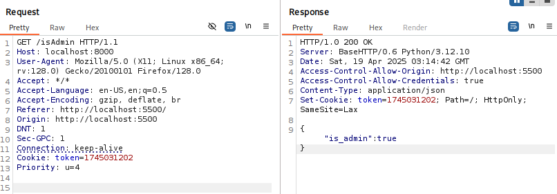

- **Script de automação usado para filtrar tokens com privilégios administrativos:**

  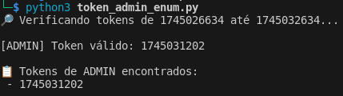

#### Impacto

Permitir a verificação direta de privilégios com respostas booleanas acessíveis a qualquer usuário facilita a identificação de contas administrativas. Isso contribui para ataques direcionados, como hijacking e escalonamento de privilégios.

#### Recomendações

- Restringir o acesso ao endpoint a funções que realmente demandem a informação, idealmente no backend.
- Evitar retornos explícitos como `true/false`; utilizar respostas genéricas ou códigos de status HTTP apropriados.
- Monitorar e registrar tentativas de acesso não autorizado a verificações de privilégios.

---
### 8. IDOR – Modificação e exclusão de dados de terceiros

#### Ponto Afetado

- Endpoint(s): `/edit-username`, `/edit-email`, `/edit-phone`, `/delete_user`
- Parâmetro(s): `id`
- Componente afetado: backend (controle de recursos)
- Abrangência: usuários autenticados

#### Descrição

A aplicação permite que usuários autenticados modifiquem ou excluam dados de outras contas ao manipular o campo `id` nas requisições, sem validação de permissões no backend. Esse comportamento caracteriza uma falha de IDOR (Insecure Direct Object Reference).

Durante os testes, foi possível:

- Alterar o nome de usuário, e-mail e telefone de outros usuários;
- Excluir permanentemente uma conta utilizando o endpoint `/delete_user`, mesmo sem privilégios administrativos.

O endpoint de exclusão não realiza nenhuma checagem de autorização, permitindo que qualquer usuário remova contas arbitrárias.

#### Classificação

- OWASP Top 10: [A01:2021 – Broken Access Control](https://owasp.org/Top10/A01_2021-Broken_Access_Control/)
- CWE: [CWE-639 – Authorization Bypass Through User-Controlled Key](https://cwe.mitre.org/data/definitions/639.html)

#### Evidências

- Requisição alterando o nome de outro usuário (`id = 05`):  
  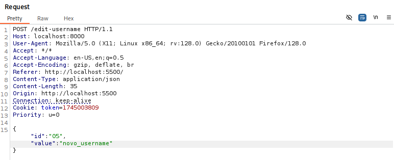

- Visualização da alteração no painel administrativo:  
  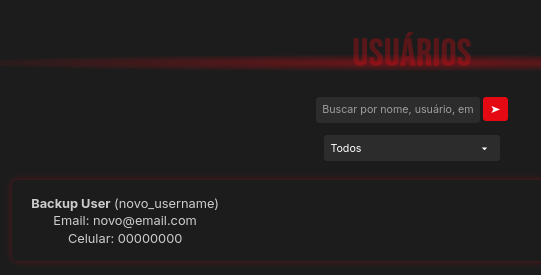

- Exclusão de usuário executada com sucesso sem ser administrador:  
  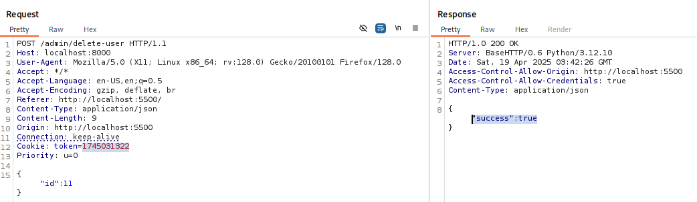

#### Impacto

A ausência de validação de permissões permite que usuários alterem ou excluam dados de outras contas, incluindo contas administrativas. Isso compromete a integridade dos dados, afeta o funcionamento da aplicação e pode facilitar ataques futuros.

#### Recomendações

- Validar no backend se o usuário autenticado tem permissão para modificar ou excluir o recurso.
- Evitar uso de parâmetros controlados pelo cliente para identificar recursos sensíveis.
- Utilizar identificadores derivados da sessão do usuário autenticado.
- Adotar registros de auditoria para ações críticas e expor mensagens seguras ao usuário.

---
### 9. Manipulação de preço via parâmetro client-side

#### Ponto Afetado

- Endpoint(s): `/order`
- Parâmetro(s): `total_price`
- Componente afetado: backend (processamento de pedidos)
- Abrangência: usuários autenticados

#### Descrição

O endpoint de criação de pedidos (`/order`) aceita o valor do campo `total_price` diretamente do cliente, sem validação ou cálculo no backend. Esse valor é gravado no banco e exibido como o preço oficial do pedido na interface administrativa.

Durante os testes, foi possível alterar esse campo para R$ 0,00 e realizar a compra normalmente, indicando ausência total de verificação no servidor.

Essa lógica transfere uma etapa crítica de negócio para o lado do cliente, permitindo fraudes, inconsistência nos registros financeiros e comprometimento da integridade dos dados.

#### Classificação

- OWASP Top 10: [A04:2021 – Insecure Design](https://owasp.org/Top10/A04_2021-Insecure_Design/)
- CWE: [CWE-302 – Authentication Bypass by Assumed-Immutable Data](https://cwe.mitre.org/data/definitions/302.html)

#### Evidências

- Pedido manipulado com `total_price: 0`, aceito com sucesso:

  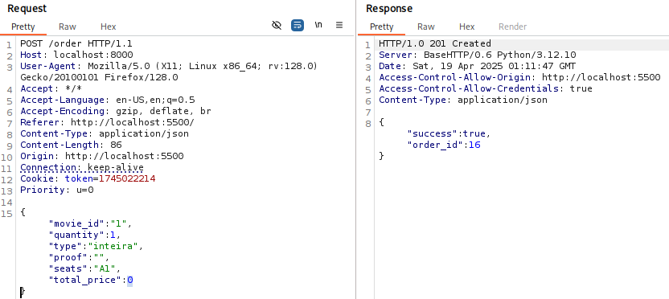
  
  

#### Impacto

Permitir que o valor do pedido seja definido pelo cliente possibilita fraudes diretas, como compras gratuitas ou com valores manipulados. Isso afeta a integridade financeira da aplicação e pode resultar em prejuízos comerciais.

#### Recomendações

- Calcular o valor total do pedido exclusivamente no backend com base nos itens e regras da plataforma.
- Ignorar valores de preço recebidos do cliente.
- Validar todos os dados de entrada antes do processamento e gravação no banco de dados.

---
### 10. Ausência de controles críticos de autenticação e recuperação de conta

#### Ponto Afetado

- Endpoint(s): `/login`, `/recover/reset`, `/edit-*`
- Parâmetro(s): –
- Componente afetado: backend (autenticação e gestão de contas)
- Abrangência: todos os usuários

#### Descrição

A aplicação não implementa mecanismos essenciais de proteção para os fluxos de autenticação e recuperação de conta, deixando usuários e administradores vulneráveis a ataques comuns.

Foram observadas as seguintes falhas:

- Ausência de proteção contra brute-force: É possível realizar múltiplas tentativas de login sem qualquer tipo de limitação, como rate limiting, CAPTCHA ou bloqueio temporário.

- Ausência de autenticação multifator (MFA): Não há suporte a segundo fator de autenticação, nem mesmo para contas administrativas.

- Ausência de notificações ou trilhas de auditoria: A aplicação não informa os usuários sobre eventos críticos, como logins, tentativas falhas, alterações de senha ou mudanças em dados sensíveis.

- Uso de perguntas pessoais na recuperação de senha: A redefinição de senha depende exclusivamente de perguntas como "cor favorita" ou "escola", que são informações facilmente dedutíveis ou disponíveis via engenharia social.

#### Classificação

- OWASP Top 10: [A07:2021 – Identification and Authentication Failures](https://owasp.org/Top10/A07_2021-Identification_and_Authentication_Failures/)
- CWE:
  - [CWE-306 – Missing Authentication for Critical Function](https://cwe.mitre.org/data/definitions/306.html)
  - [CWE-307 – Improper Restriction of Excessive Authentication Attempts](https://cwe.mitre.org/data/definitions/307.html)
  - [CWE-521 – Weak Password Requirements](https://cwe.mitre.org/data/definitions/521.html)
  - [CWE-640 – Weak Password Recovery Mechanism for Forgotten Password](https://cwe.mitre.org/data/definitions/640.html)

  *Esta seção consolida múltiplas falhas complementares dentro do fluxo de autenticação e gerenciamento de contas. Todas contribuem conjuntamente para o risco identificado.*

#### Evidências

- Tentativas de login ilimitadas sem bloqueio observado
- Nenhuma comunicação recebida por e-mail após ações críticas
- Ausência de campo ou interface para MFA em todo o fluxo da aplicação

#### Impacto

A falta de controles adequados nos fluxos de autenticação e recuperação de contas facilita ataques como brute-force, hijacking e engenharia social. Isso compromete diretamente a confidencialidade e integridade das contas de usuários e administradores.

#### Recomendações

- Implementar limitação de tentativas e bloqueios temporários em casos de falha repetida no login.
- Adotar autenticação multifator, especialmente para contas privilegiadas.
- Enviar notificações de eventos críticos (logins, mudanças de senha ou dados).
- Substituir perguntas de segurança por métodos mais robustos de verificação, como tokens de recuperação temporários.
- Aplicar política de senha forte com validação de complexidade e tamanho.
